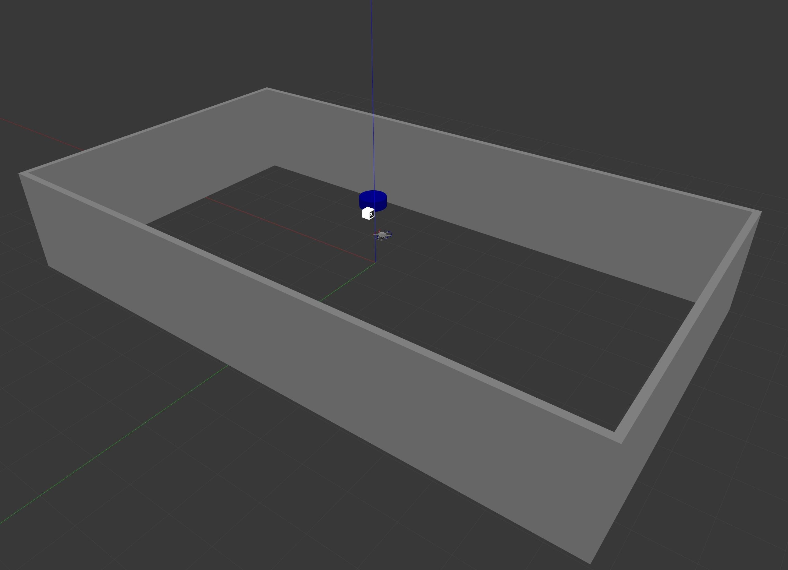

[![MIT License][license-shield]][license-url]
[![Issues][issues-shield]][issues-url]
[![LinkedIn][linkedin-shield]][linkedin-url]


<br />
<p align="center">
  <a href="https://github.com/ZiyouZhang/rotors_datmo">
    
  </a>

  <h3 align="center">rotors_datmo</h3>

  <p align="center">
    A package for detection and tracking of moving objects 
    using visual-based EKF state estimation in RotorS simulation.
    <br />
    <a href="https://github.com/ZiyouZhang/rotors_datmo"><strong>Explore the docs »</strong></a>
    <br />
    <a href="https://github.com/ZiyouZhang/rotors_datmo/blob/misc/demo.mp4">View Demo</a>
    ·
    <a href="https://github.com/ZiyouZhang/rotors_datmo/issues">Report Bug</a>
    ·
    <a href="https://github.com/ZiyouZhang/rotors_datmo/issues">Request Feature</a>
  </p>
</p>


# Table of Contents

* [Overview](#Overview)
* [Installation](#Installation)
  * [Prerequisites](#Prerequisites)
  * [Dependencies](#Dependencies)
  * [Building from Source](#Building-from-Source)
  * [Symbolic Links](#Symbolic-Links)
* [Usage](#Usage)
* [Nodes](#Nodes)
* [Bugs & Feature Requests](#Bugs-&-Feature-Requests)
* [License](#License)
* [Contact](#Contact)


# Overview

This is an extension to the [RotorS gazebo simulator](https://github.com/ethz-asl/rotors_simulator). The package implementes visual detection and tracking of moving objects (visual-DATMO) for obejects tagged with AprilTag fiducial markers. EKF estimation is used for estimate the dynamic object state. This work is carried out for further investigation of visual-based MAV collision avoidance.

**Keywords:** ROS, RotorS, EKF, Visual-DATMO, Collision Avoidance

**Author: Ziyou Zhang<br />
Maintainer: Ziyou Zhang, ziyou.zhang@outlook.com**

The rotors_datmo package has been tested under [ROS](https://www.ros.org/) Melodic and Ubuntu 18.04. This is research code, expect that it changes often and any fitness for a particular purpose is disclaimed.




# Installation

## Prerequisites

Follow the [instructions](https://github.com/ethz-asl/rotors_simulator) to install RotorS.

## Dependencies

- [Robot Operating System (ROS)] (middleware for robotics)
- [AprilTag] (middleware for robotics)
- [Eigen] (linear algebra library)

## Building from Source

To build from source, clone the latest version from this repository into the rotors_simulation folder in your catkin workspace and compile the package using:

```
cd catkin_workspace/src
cd rotors_simulator
git clone https://github.com/ZiyouZhang/rotors_datmo.git
cd ..
catkin build
```

## Symbolic Links

Create symblic link of the model files in the rotors_gazebo/model folder. For example:

```
ln -s <path to rotors_simulation>/rotors_datmo/models/tag_box <path to rotors_simulation>/rotors_gazebo/models/
```

Create symblic link of the urdf files in the rotors_description/urdf folder. For example:

```
ln -s <path to rotors_simulation>/rotors_datmo/urdf/mav_with_camera.gazebo <path to rotors_simulation>/rotors_description/urdf/
```

Create symblic link of the world files in the rotors_gazebo/model folder. For example:

```
ln -s <path to rotors_simulation>/rotors_datmo/worlds/apriltag_sim.world <path to rotors_simulation>/rotors_gazebo/worlds/
```


# Usage

Run the simulation with:

```
roslaunch rotors_datmo apriltag_sim.launch
```


# Nodes
## apriltag_detection_node

Analyse the captured images and estimate the dynamic object state.


### Subscribed Topics

* **`/firefly/camera_nadir/image_raw`** ([sensor_msgs/Image])

	The image obtained from the camera.


### Published Topics

* **`/detected_object_state`** ([nav_msgs/Odometry])

  The calculated object state purely based on sensor measurement.

* **`/predicted_object_state`** ([nav_msgs/Odometry])

  The predicted object state based on the current object state and the motion model. (State after EKF prediction phase.)

* **`/updated_object_state`** ([nav_msgs/Odometry])
  The updated object state based on the current object state, the motion model and sensor measurment. (State after EKF update phase.)


# Bugs & Feature Requests

Please report bugs and request features using the [Issue Tracker](https://github.com/ZiyouZhang/rotors_datmo/issues).


<!-- LICENSE -->
# License

The source code is released under a [MIT license](https://github.com/ZiyouZhang/rotors_datmo/blob/master/LICENSE.md). See `LICENSE.md` for more information.


<!-- CONTACT -->
# Contact

Ziyou Zhang - ziyou.zhang@outlook.com


<!-- MARKDOWN LINKS & IMAGES -->
<!-- https://www.markdownguide.org/basic-syntax/#reference-style-links -->
[license-shield]: https://img.shields.io/github/license/ZiyouZhang/rotors_datmo.svg?style=flat-square
[license-url]: https://github.com/ZiyouZhang/rotors_datmo/blob/master/LICENSE.md
[issues-shield]: https://img.shields.io/github/issues/ZiyouZhang/rotors_datmo.svg?style=flat-square
[issues-url]: https://github.com/ZiyouZhang/rotors_datmo/issues
[linkedin-shield]: https://img.shields.io/badge/-LinkedIn-black.svg?style=flat-square&logo=linkedin&colorB=555
[linkedin-url]: https://www.linkedin.com/in/ziyou-zhang/

[sensor_msgs/Image]: http://docs.ros.org/melodic/api/sensor_msgs/html/msg/Image.html
[nav_msgs/Odometry]: http://docs.ros.org/melodic/api/nav_msgs/html/msg/Odometry.html
[Robot Operating System (ROS)]: http://wiki.ros.org
[AprilTag]: https://github.com/AprilRobotics/apriltag
[Eigen]:http://eigen.tuxfamily.org/